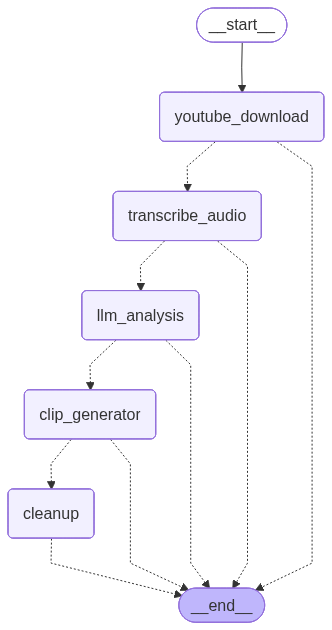
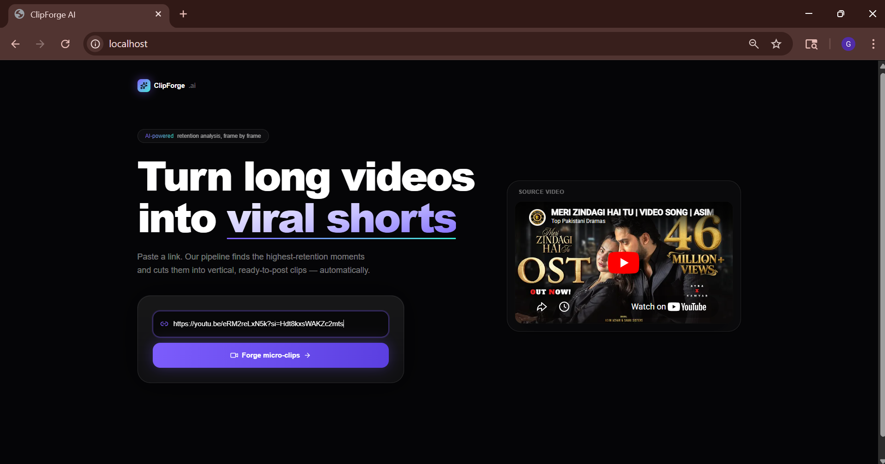
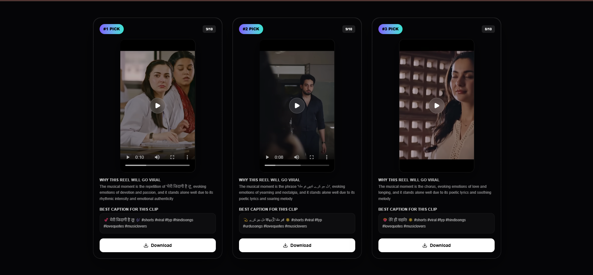

<div align="center">

# 🎬 ClipForge

### **AI-Powered Viral Clip Generator**

Transform long-form YouTube videos into **high-retention, viral-ready vertical shorts** automatically using AI.

<p align="center">

[](LICENSE)
[](https://www.python.org/)
[](https://nextjs.org/)
[](https://www.docker.com/)
[](https://github.com/features/actions)

</p>

</div>

---

ClipForge automates the entire content repurposing workflow — from downloading YouTube videos to producing **ready-to-post short-form clips**.

The complete AI pipeline:

🎥 Download YouTube Videos → 🎙️ Generate Ultra-fast Transcripts → 🧠 Analyze Viral Potential using LLMs → ✂️ Extract High-Retention Segments → 💬 Burn Dynamic Captions → ⚡ Stream Live Progress Updates → 📱 Export Vertical Shorts

---

## 📑 Table of Contents

- [Features](#-features)
- [System Architecture](#️-system-architecture)
- [Workflow Graph](#-workflow-graph)
- [Demo](#-demo)
- [Screenshots](#-screenshots)
- [Tech Stack](#️-tech-stack)
- [Project Structure](#-project-structure)
- [Prerequisites](#-prerequisites)
- [Getting Started](#-getting-started)
- [Environment Variables](#-environment-variables)
- [Running with Docker](#-running-with-docker)
- [Local Development](#-local-development)
- [API Processing Flow](#-api-processing-flow)
- [Known Limitations](#️-known-limitations)
- [Roadmap](#-roadmap)
- [Contributing](#-contributing)
- [License](#-license)
- [Support](#-support)
- [Author](#-author)

---

## ✨ Features

- 🎥 Download YouTube videos using **yt-dlp**
- 🎙️ Ultra-fast speech transcription
- 🧠 AI-powered viral moment detection using LLMs
- ✂️ Automatic highlight extraction with FFmpeg
- 💬 Dynamic burned-in captions
- ⚡ Real-time progress updates using Server-Sent Events (SSE)
- 🚀 Parallel clip generation
- 📱 Beautiful responsive Next.js frontend
- 🐳 Fully Dockerized

---

## 🏗️ System Architecture

```text
                 +------------------+
                 |    Next.js UI    |
                 +---------+--------+
                           |
                    HTTP + SSE
                           |
                 +---------v--------+
                 |   FastAPI API    |
                 +---------+--------+
                           |
                    LangGraph Pipeline
                           |
      +----------+---------+----------+-----------+
      |          |                    |           |
 Download   Transcription     LLM Analysis   Clip Export
      |          |                    |           |
      +----------+---------+----------+-----------+
                           |
                    Generated Shorts
```

---

## 🔄 Workflow Graph

<p align="center">
  
</p>

---

## 🎥 Demo

### Application Walkthrough

<p align="center">
  <video src="images/demo.mp4" controls width="100%"></video>
</p>

---

## 📸 Screenshots

### Home Page

<p align="center">
  
</p>

### Results

<p align="center">
  
</p>

---

## ⚙️ Tech Stack

| Layer | Technologies |
|---|---|
| **Frontend** | Next.js, React, TypeScript, Tailwind CSS, Framer Motion |
| **Backend** | FastAPI, LangGraph, LangChain, Groq LLM, Pydantic, FFmpeg, yt-dlp |
| **DevOps** | Docker, Docker Compose |

---

## 📂 Project Structure

```text
Clip_forge
├─ backend
│  ├─ .dockerignore
│  ├─ app.py
│  ├─ Dockerfile
│  ├─ exceptions.py
│  ├─ graph.py
│  ├─ graph_runner.py
│  ├─ job_manager.py
│  ├─ model
│  │  ├─ llm.py
│  │  └─ prompts.py
│  ├─ nodes
│  │  ├─ cleanup_disk.py
│  │  ├─ cut_clips.py
│  │  ├─ llm_analysis.py
│  │  ├─ transcript.py
│  │  ├─ yt_download.py
│  │  └─ __init__.py
│  ├─ requirements.txt
│  └─ state.py
├─ docker-compose.yml
├─ frontend
│  ├─ .dockerignore
│  ├─ app
│  │  ├─ globals.css
│  │  ├─ layout.tsx
│  │  └─ page.tsx
│  ├─ components
│  │  ├─ AmbientBackground.tsx
│  │  ├─ ClipCard.tsx
│  │  ├─ Hero.tsx
│  │  ├─ ResultsSection.tsx
│  │  ├─ SiteHeader.tsx
│  │  ├─ SourceVideoEmbed.tsx
│  │  └─ UrlInputCard.tsx
│  ├─ Dockerfile
│  ├─ eslint.config.mjs
│  ├─ hooks
│  │  └─ useClipGeneration.ts
│  ├─ lib
│  │  ├─ backend.ts
│  │  └─ youtube.ts
│  ├─ next.config.ts
│  ├─ package-lock.json
│  ├─ package.json
│  ├─ public
│  │  ├─ file.svg
│  │  ├─ globe.svg
│  │  ├─ next.svg
│  │  ├─ vercel.svg
│  │  └─ window.svg
│  ├─ tsconfig.json
│  └─ types
│     ├─ clip.ts
│     └─ job.ts
├─ images
│  ├─ demo.mp4
│  ├─ graph.png
│  ├─ home.png
│  └─ results.png
├─ LICENSE
└─ README.md

```

---

## ✅ Prerequisites

Before running ClipForge locally, make sure you have:

- **Python** 3.12+
- **Node.js** 18+ and npm
- **FFmpeg** installed and available on your `PATH`
- **Docker & Docker Compose** (if running via containers)
- A **Groq API key** (or your preferred LLM provider key) for the analysis step

---

## Steps to run:

Clone the repository:

```bash
git clone https://github.com/gaoharimran29-glitch/Clip_Forge.git

cd Clip_Forge
```

---

## 🔐 Environment Variables

Create a `.env` file in the project root using the provided `.env.example` as a template.

| Variable | Description |
|---|---|
| `GROQ_API_KEY` | API key used for LLM-based viral moment analysis |
| `NEXT_PUBLIC_API_URL` | URL the frontend uses to reach the FastAPI backend |
| `CORS_ORIGIN` | CORS URL So backend can communicate with frontend |

---

## 🐳 Running with Docker

```bash
docker compose up --build
```

The application will be available at:

```text
http://localhost
```

---

## 💻 Local Development

### Backend

```bash
cd backend

pip install -r requirements.txt

uvicorn app:app --reload
```

### Frontend

```bash
cd frontend

npm install

npm run dev
```

---

## 📡 API Processing Flow

```text
POST /generate
        │
        ▼
 Create Background Job
        │
        ▼
 Execute LangGraph Pipeline
        │
        ▼
 Stream Live Progress (SSE)
        │
        ▼
 Return Generated Clips
```

---

## ⚠️ Known Limitations

- **YouTube download reliability**: `yt-dlp` occasionally hits YouTube's bot-detection checks, particularly when running from datacenter/cloud IPs (e.g. AWS, GCP). If you hit a `Sign in to confirm you're not a bot` error, keeping `yt-dlp` updated (`pip install -U yt-dlp`) and supplying a valid cookies file are the most reliable fixes for local/dev use.
- Clip quality depends on transcription accuracy and the underlying LLM's judgment of "viral" moments — results may vary by content type.

---
## 🗺️ Roadmap
 
- [ ] **Browser extension for reliable video capture** — move video acquisition client-side (via a companion extension) so the pipeline no longer depends on server-side `yt-dlp` calls hitting YouTube's bot detection from a datacenter IPs

---

## 🤝 Contributing

Contributions, feature requests, and bug reports are welcome!

1. Fork the repository
2. Create a feature branch
3. Commit your changes
4. Push the branch
5. Open a Pull Request

---

## 📄 License

This project is licensed under the **MIT License**.

---

## 🌟 Support

If you found ClipForge useful, please consider giving this repository a **⭐ Star**.

It helps others discover the project and motivates future development.

---

## 👤 Author

Built by **Gaohar Imran**
- GitHub: [@gaoharimran29-glitch](https://github.com/gaoharimran29-glitch)
- LinkedIn: [Gaohar Imran](https://www.linkedin.com/in/gaohar-imran-5a4063379/)